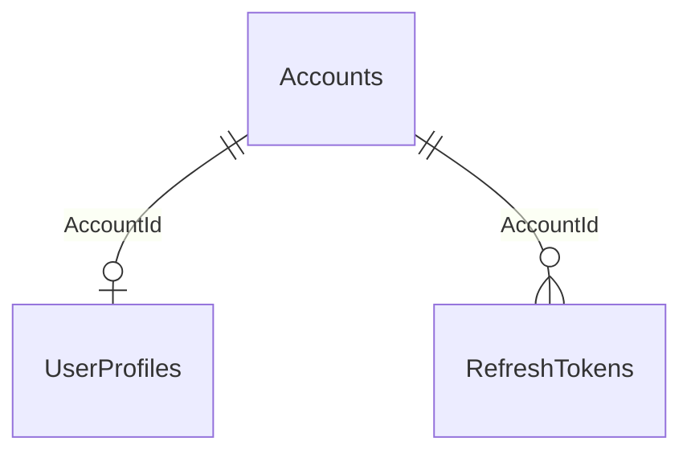

# Cấu trúc database UniNet BE

## Schema hiện tại — database v2 (30/09/2026)

Nguồn thiết kế: `UniNet_Database_Design_v2.docx`. Migration mới: `20261003132450_AlignDatabaseDesignV2`. Thiết kế cuối tài liệu có **6 bảng**, bao gồm `Skills`.

| Bảng | Dữ liệu chính / quan hệ |
| --- | --- |
| Accounts | Id, Email, PasswordHash, GoogleId, GoogleEmail, Role, Status, EmailVerified, LastLoginAt, CreatedAt, UpdatedAt. Email unique; GoogleId unique khi khác NULL. |
| Users | Id, AccountId unique; FullName varchar(255), Nickname varchar(100) bắt buộc. AvatarUrl, CoverUrl, Bio, Phone varchar(30), Address; UniversityName/Major varchar(255), StudentCode varchar(50); OrganizationName varchar(255), PartnerType smallint, Industry varchar(150), Website, ContactEmail varchar(255); IsVerified, CreatedAt, UpdatedAt. Không còn cột DisplayName/TaxCode. |
| UserVerifications | Id, UserId FK → Users (1:N), VerificationType/Status smallint; VerificationData jsonb bắt buộc, DocumentUrls jsonb tùy chọn; RejectReason; ReviewedBy FK → Accounts tùy chọn, SubmittedAt, ReviewedAt, CreatedAt, UpdatedAt. |
| CareerProfiles | Id, UserId unique FK → Users (0..1), Headline varchar(255), CareerObjective; BasicInfoJson, EducationJson, SkillsJson, ExperienceJson, ProjectsJson, CertificatesJson, ActivitiesJson, LanguagesJson, SocialLinksJson, AppearanceJson đều jsonb tùy chọn; IsPublic, CreatedAt, UpdatedAt. |
| Skills | Id, Name/Slug varchar(100) bắt buộc, Slug unique; IconUrl, Category smallint, Description, DisplayOrder integer, IsActive, CreatedAt, UpdatedAt. |
| RefreshTokens | Id, AccountId FK → Accounts (1:N), TokenHash unique, ExpiresAt, RevokedAt, DeviceId/DeviceName varchar(255), CreatedAt. Chỉ lưu hash token. |

PK/FK dùng uuid; timestamp dùng timestamptz; các chuỗi không nêu giới hạn dùng text. Cột hồ sơ theo loại người dùng là nullable; boolean/trạng thái và thời điểm tạo/cập nhật là bắt buộc. UserVerification.DocumentUrls và VerificationData không nằm trong DTO hồ sơ.

Index bổ sung: Users(UniversityName, Major), UserVerifications(UserId, Status), CareerProfiles GIN(SkillsJson)/GIN(ProjectsJson), Skills(Category, IsActive, DisplayOrder). CareerProfiles.UserId và Users.AccountId unique. Reviewer FK dùng RESTRICT; các FK sở hữu dùng CASCADE.

Enum mới: VerificationType (Student=0, Partner=1), VerificationStatus (Pending=0, Approved=1, Rejected=2, Cancelled=3), VerificationDocumentType (StudentCard=0, StudentConfirmation=1, SchoolEmail=2, BusinessRegistration=3, OrganizationDocument=4, Other=5), SkillLevel (Beginner=0, Intermediate=1, Advanced=2, Expert=3), SkillCategory (Frontend=0, Backend=1, Mobile=2, Database=3, DevOps=4, Tools=5, Design=6, AI=7, Other=8).

SkillsJson dùng skillId, level, yearsOfExperience theo thiết kế cuối mục 7.1; không dùng mẫu skillKey ở mục 6.1. API ghi JSON trong tương lai phải kiểm tra schema/version và tham chiếu skillId. Đổi template chỉ cập nhật AppearanceJson.

Migration giữ ID/account/token, đổi UserProfiles → Users và DisplayName → FullName. Nickname lấy tối đa 100 ký tự tên cũ; OrganizationName lấy tên cũ của Partner. TaxCode cũ và trạng thái verified cũ được giữ trong snapshot pending; cờ IsVerified cũ chuyển false để xác minh lại có lịch sử duyệt. Xem [handoff database v2](handoffs/database-v2.md) về hợp đồng API và nâng cấp/rollback. Database ứng dụng chưa được áp dụng migration vì chưa cấu hình kết nối.

## Schema v1 — lưu để đối chiếu lịch sử

Phần bên dưới mô tả migration cũ, không phải schema hiện tại sau khi nâng cấp v2.

Tài liệu này mô tả schema PostgreSQL được định nghĩa trong `UniNetDbContext` và migration `20260923132543_AddAuthenticationAndUserProfiles`. Đây là schema trong mã nguồn; trạng thái của một database đang chạy phụ thuộc vào các migration đã được áp dụng trên database đó.

## Tổng quan

| Bảng | Mục đích |
| --- | --- |
| `Accounts` | Tài khoản, phương thức đăng nhập, vai trò và trạng thái. |
| `UserProfiles` | Thông tin hồ sơ của tài khoản; tối đa một hồ sơ cho mỗi tài khoản. |
| `RefreshTokens` | Refresh token theo tài khoản và thiết bị; một tài khoản có thể có nhiều token. |

## `Accounts`

| Cột | Kiểu PostgreSQL | NULL | Mô tả / ràng buộc |
| --- | --- | --- | --- |
| `Id` | `uuid` | Không | Khóa chính. |
| `Email` | `varchar(255)` | Không | Email đăng nhập; unique. |
| `PasswordHash` | `text` | Có | Hash mật khẩu, có thể trống với tài khoản đăng nhập bằng Google. |
| `GoogleId` | `varchar(255)` | Có | Định danh Google; unique khi có giá trị. |
| `GoogleEmail` | `varchar(255)` | Có | Email nhận từ Google. |
| `Role` | `smallint` | Không | Vai trò; ràng buộc giá trị từ 0 đến 2. |
| `Status` | `smallint` | Không | Trạng thái; ràng buộc giá trị từ 0 đến 3. |
| `EmailVerified` | `boolean` | Không | Email đã xác thực hay chưa. |
| `LastLoginAt` | `timestamptz` | Có | Lần đăng nhập gần nhất. |
| `CreatedAt` | `timestamptz` | Không | Thời điểm tạo. |
| `UpdatedAt` | `timestamptz` | Không | Thời điểm cập nhật. |

Index: `IX_Accounts_Email` (unique), `IX_Accounts_GoogleId` (unique). Check constraint: `CK_Accounts_Role`, `CK_Accounts_Status`.

## `UserProfiles`

| Cột | Kiểu PostgreSQL | NULL | Mô tả / ràng buộc |
| --- | --- | --- | --- |
| `Id` | `uuid` | Không | Khóa chính. |
| `AccountId` | `uuid` | Không | Khóa ngoại đến `Accounts.Id`; unique. |
| `DisplayName` | `varchar(255)` | Không | Tên hiển thị. |
| `AvatarUrl` | `text` | Có | URL ảnh đại diện. |
| `CoverUrl` | `text` | Có | URL ảnh bìa. |
| `Bio` | `text` | Có | Giới thiệu. |
| `UniversityName` | `varchar(255)` | Có | Tên trường. |
| `Major` | `varchar(255)` | Có | Ngành học. |
| `StudentCode` | `varchar(50)` | Có | Mã sinh viên. |
| `PartnerType` | `smallint` | Có | Loại đối tác; nếu có thì từ 0 đến 4. |
| `Industry` | `varchar(150)` | Có | Lĩnh vực hoạt động. |
| `Website` | `text` | Có | Website. |
| `ContactEmail` | `varchar(255)` | Có | Email liên hệ. |
| `Phone` | `varchar(30)` | Có | Số điện thoại. |
| `Address` | `text` | Có | Địa chỉ. |
| `TaxCode` | `varchar(50)` | Có | Mã số thuế. |
| `IsVerified` | `boolean` | Không | Hồ sơ đã được xác minh hay chưa. |
| `CreatedAt` | `timestamptz` | Không | Thời điểm tạo. |
| `UpdatedAt` | `timestamptz` | Không | Thời điểm cập nhật. |

Index: `IX_UserProfiles_AccountId` (unique). Check constraint: `CK_UserProfiles_PartnerType`. Xóa `Accounts` sẽ xóa hồ sơ tương ứng (`ON DELETE CASCADE`).

## `RefreshTokens`

| Cột | Kiểu PostgreSQL | NULL | Mô tả / ràng buộc |
| --- | --- | --- | --- |
| `Id` | `uuid` | Không | Khóa chính. |
| `AccountId` | `uuid` | Không | Khóa ngoại đến `Accounts.Id`. |
| `TokenHash` | `text` | Không | Hash của refresh token; unique. |
| `ExpiresAt` | `timestamptz` | Không | Thời điểm hết hạn. |
| `RevokedAt` | `timestamptz` | Có | Thời điểm thu hồi, nếu có. |
| `DeviceId` | `varchar(255)` | Có | Định danh thiết bị. |
| `DeviceName` | `varchar(255)` | Có | Tên thiết bị. |
| `CreatedAt` | `timestamptz` | Không | Thời điểm tạo. |

Index: `IX_RefreshTokens_AccountId`, `IX_RefreshTokens_ExpiresAt`, `IX_RefreshTokens_TokenHash` (unique). Xóa `Accounts` sẽ xóa các token liên quan (`ON DELETE CASCADE`).

## Giá trị enum lưu trong database

| Cột | Giá trị |
| --- | --- |
| `Accounts.Role` | `0` Student, `1` Partner, `2` Admin |
| `Accounts.Status` | `0` Pending, `1` Active, `2` Suspended, `3` Deleted |
| `UserProfiles.PartnerType` | `0` Company, `1` School, `2` Store, `3` TrainingCenter, `4` Other; có thể `NULL` |

Các giá trị khởi tạo như `Id`, `CreatedAt`, `UpdatedAt` và `Status = Active` được đặt trong entity C# khi tạo đối tượng; migration hiện tại không khai báo database default cho các cột này. EF Core cũng có thể tạo bảng hệ thống `__EFMigrationsHistory` để theo dõi migration đã áp dụng; bảng đó không phải entity nghiệp vụ của ứng dụng.
